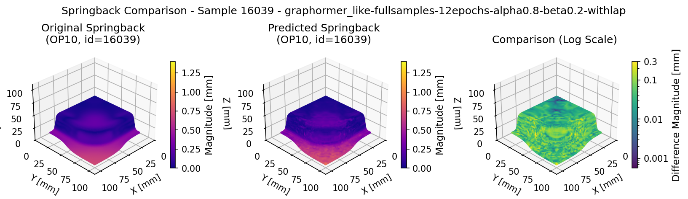
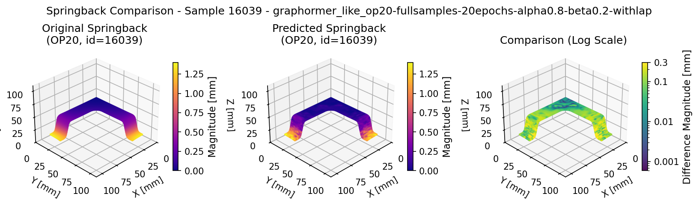
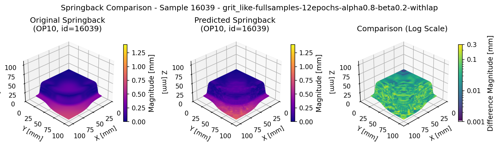
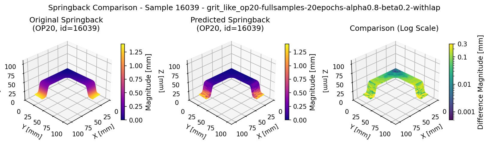

# RT-3875
Research Project:  Potential Interaction of Graph Reconstruction Methods and Transformers

# Name
Yueyang Jiang (st186731)

# Python environment setup with uv
> ```bash
> # Install uv (once)
> curl -LsSf https://astral.sh/uv/install.sh | sh
>
> # Inside repo root:
> uv venv
> source .venv/bin/activate
>
> # Install required packages 
> uv pip install torch==2.8.0 --extra-index-url https://download.pytorch.org/whl/cu128
> uv pip install h5py
> uv pip install tqdm
> uv pip install pandas
> uv pip install torch-scatter torch-sparse torch-cluster torch-spline-conv torch-geometric \
>   -f https://data.pyg.org/whl/torch-2.8.0+cu128.html --trusted-host data.pyg.org
> uv pip install rdkit
> uv pip install torchmetrics
> uv pip install ogb
> uv pip install tensorboardX
> uv pip install yacs
> uv pip install opt_einsum
> uv pip install graphgym 
> uv pip install pytorch-lightning
> uv pip install setuptools
> uv pip install matplotlib
> uv pip install scipy
> ```

# The architecture of hybrid_approach
> ```bash
> hybrid_approach/                          
> ├─ config_yaml/                     # the configurations for these approaches.
> ├─ evaluation/                      # where you can implement the evaluation.
> ├─ feature_extraction/              # where you can extract the features.
> ├─ grit_like_and_graphormer_like/   # crucial files for hybrid_approach.
> │  ├─ framework/                    # where you can find components of models such as encoder, head, layer, loader, loss funtion, network, and optimizer.
> │  ├─ main.py                       # where you can run the training loop.
> │  ├─ predict.py                    # where you can predict the springback.
> ├─ visualization/                   # where you can implement the visualization.
> ├─ .gitignore
> ├─ LICENSE
> └─ README.md
> ```

# Run the code
> ```bash
> # Clone the code
> git clone https://github.com/BaumSebastian/RP-3875.git
>
> # Extract required features
> python /home/RUS_CIP/st186731/research_project/hybrid_approach/feature_extraction/dataset_feature_extraction.py
>
> # Run the training loop
> # The YAML with grit_like is for op10. The YAML with graphormer_like is for op20.
> cd /home/RUS_CIP/st186731/research_project/hybrid_approach/grit_like_and_graphormer_like
> python main.py --cfg /home/RUS_CIP/st186731/research_project/hybrid_approach/config_yaml/ddacs-node-regression.yaml accelerator "cuda:0" optim.max_epoch 15 seed 41 dataset.dir '/mnt/data/jiang'
> 
> # You can choose to replace "./ddacs-node-regression.yaml" with other YAML files you want to run. You can find YAML files in "./config_yaml/XX.yaml"
> # You can choose to replace "cuda:0" with the GPU "cuda:X" you want to use
> # You can choose to replace "optim.max_epoch 12" with the epochs you want to train
> # You can choose to replace "seed 41" with the random seed you want to set
> # You can choose to replace '/mnt/data/jiang' with '/mnt/data/jiang/op20' for op20
>
> # Implement the Prediction
> python predict.py --cfg /home/RUS_CIP/st186731/research_project/hybrid_approach/config_yaml/ddacs-node-regression.yaml --ckpt /home/RUS_CIP/st186731/research_project/hybrid_approach/grit_like_and_graphormer_like/results/ddacs-node-regression/41/ckpt/14.ckpt --dataset_dir /mnt/data/jiang --out /home/RUS_CIP/st186731/research_project/hybrid_approach/grit_like_and_graphormer_like/prediction/ddacs-node-regression/grit_like --batch_size 16 --accelerator "cuda:0"
>
> # "data_dir" should be set to the folder containing the original DDACS dataset!!!!!!!!!!!!
> # replace "./ddacs-node-regression.yaml" with other YAML files you want to run. You can find YAML files in "./config_yaml/XX.yaml"
> # You can choose to replace "./hybrid_approach/grit_like_and_graphormer_like/results/ddacs-node-regression/41/ckpt/14.ckpt" with other checkpoints "./hybrid_approach/grit_like_and_graphormer_like/results/ddacs-node-regression-XX/XX/ckpt/XX.ckpt"
> # You can choose to replace "./hybrid_approach/grit_like_and_graphormer_like/prediction/ddacs-node-regression/grit_like" with other output path
> # You can choose to replace '/mnt/data/jiang' with '/mnt/data/jiang/op20' for op20
> # You can choose to replace "cuda:0" with the GPU "cuda:X" you want to use
>
> # Implement the visualization
> python /home/RUS_CIP/st186731/research_project/hybrid_approach/visualization/visualization.py
>
> # The following parameters should be revised in the visualizaiton.py!!!!!
> # "data_dir" must be set to the folder containing the original DDACS dataset!!!!!!!!!!!!
> # replace "operation = 10" with "operation = 20" for op20
> # replace "timestep = 2" with "timestep = 0" for op20
> # replace 'pred_dir = "./hybrid_approach/grit_like_and_graphormer_like/prediction/ddacs-node-regression/grit_like"' with other prediction directories
> # replace "save_dir " with other save directories "./figures/grit_like_XX" or "./figures/graphormer_like_XX"
>
> # Implement the evaluation
> python /home/RUS_CIP/st186731/research_project/hybrid_approach/evaluation/evaluation.py
>
> # The following parameters should be revised in the evaluation.py!!!!!
> # You can choose to replace "operation = 10" with "operation = 20" for op20
> # You can choose to replace "timestep = 2" with "timestep = 0" for op20
> # You can choose to replace 'pred_dir_1 = "/home/RUS_CIP/st186731/research_project/hybrid_approach/grit_like_and_graphormer_like/prediction/ddacs-node-regression/grit_like-fullsamples-10epochs-alpha0.8-beta0.2-grit_likewithlap"' with other prediction directories
> # replace 'pred_dir_2 = "/home/RUS_CIP/st186731/research_project/hybrid_approach/grit_like_and_graphormer_like/prediction/ddacs-node-regression/graphormer_like-fullsamples-10epochs-alpha0.8-beta0.2-graphormer_likewithlap"' with other prediction directories
> # You can choose to replace "save_dir " with other save directories
> # You can choose to replace "experiment_name" with other names
> ```

# Note
> ```bash
> There is one failure case (ddacs-node-regression-grit.yaml), but I keep the code for further study in the future. This approach has the out-of-memory issue.
> ```

# Springback prediction results for grit-like and graphormer-like hybrid approaches




